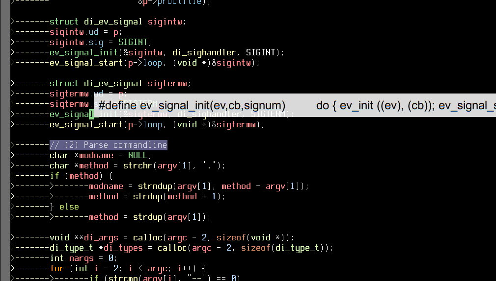

# tooltip.nvim

This neovim plugin allows you to display a tooltip positioned at given row and column.

It can be used in conjunction with tools like [LanguageClient-neovim](https://github.com/autozimu/LanguageClient-neovim) to show useful information about the text around the cursor.



Your terminal emulator needs to set the `WINDOWID` environment variable. Most of the modern terminals do this.

This plugin will also work inside tmux.

**Notice:** This plugin is mostly a Proof-of-Concept

# Requirements

You need those python modules:

* PyGObject
* cairo
* python-xlib

Other dependencies:

* Gtk
* Pango

# Usage

To show the tooltip:

```vim
"text can contain pango markup, see https://developer.gnome.org/pango/stable/PangoMarkupFormat.html
call ShowTooltip(<row>, <column>, <text>)
```

To hide the tooltip:

```vim
call HideTooltip()
```

# Configuration

You can change the border width of the tooltip:

```vim
let g:tooltip_border_width = 2
```
